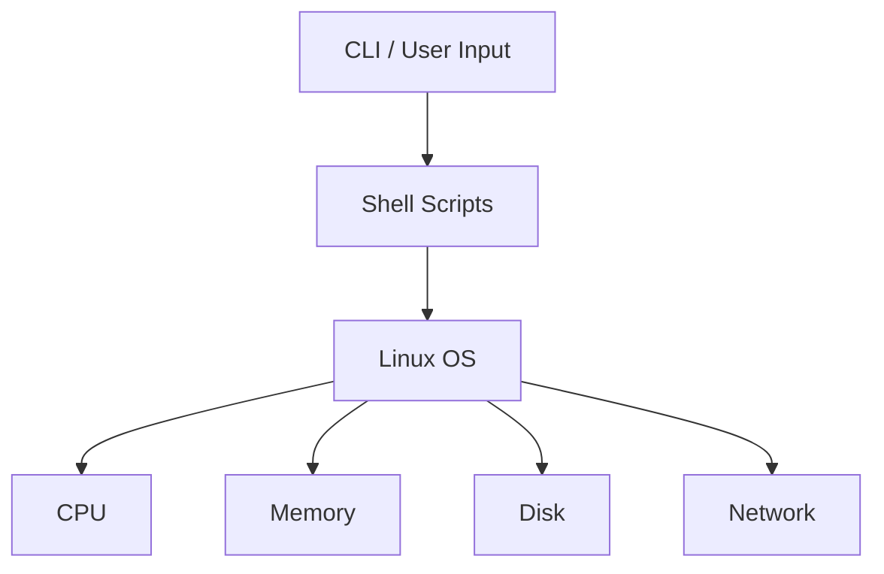

<!-- ===================== TERMINAL HEADER ===================== -->
<p align="center">
  
</p>

<p align="center">
  <em>
    Have you checked the logs? 👀
  </em>
</p>
<!-- ===================== SUBTLE ICON LINKS ===================== -->
<p align="center">
  <a href="https://www.linkedin.com/in/syeda-umme-kulsum" title="LinkedIn">
    
  </a> 
  <a href="https://github.com/syedaumme" title="GitHub">
    
  </a>
</p>

---


## 🧩 My Vibe


I work between **applications** and **infrastructure**.

- When something breaks:
```
🟢 logs → 🔵 metrics → 🟣 understanding
```

---

## 🛠 Tech Stack & Arsenal

<p align="center">
  
</p>

```md
OS & Systems   : Linux (CentOS, Ubuntu)
DevOps / SRE  : Docker, Jenkins, CI/CD, GitHub
Scripting     : Bash, Python
Data          : SQL, metrics, logs
Applications  : Flask, backend services
Operations    : Monitoring, incident support
```
## 🧭 How I Think About Systems

<p align="center">
  <em>
    Focus: system inspection • shell automation • fundamentals
  </em>
</p>

---

<p align="center"> </p> <p align="center">  </p> 
